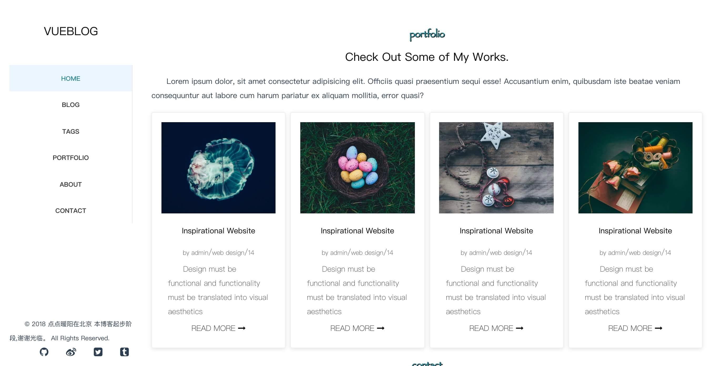

# vue-capriccio

### vue随笔集

#### 关于用法

1. cd vueBlog

2. npm i 

3. npm run dev 

4. npm run build

5. npm run build --report

   #### mock数据

   使用JSON server搭建的mock服务器

   启动mock服务器： npm run mock

   访问http://localhost:3000/ 发现db.json下的第一级json对象被解析成为可访问路径。本项目还可以用post增加保存一些数据。

### 首页目前为简历内容

####首页

##### 关于我

####简历

##### 项目

###### 找到我

##### 代码持续更新，加油

